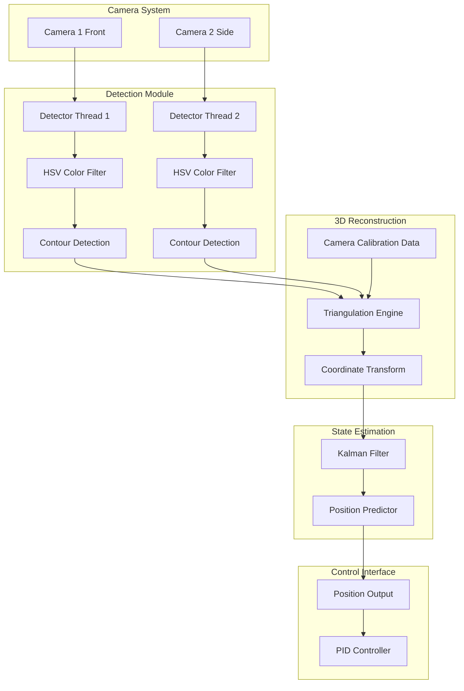
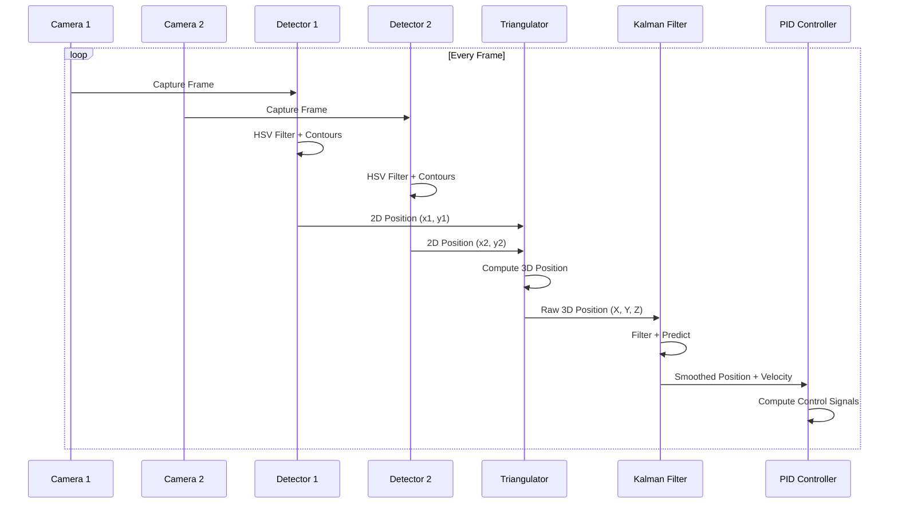

# 3D Drone Localization Architecture
## Two-Camera System for Cage-Based Drone Tracking

---

## System Overview

This architecture enables 3D position tracking of a drone within a 1.5m x 1.5m cage using two cameras positioned at 90-degree angles (front and side). The system combines computer vision, geometric triangulation, and filtering to provide real-time 3D coordinates for PID-based hover control.

### Key Components
1. **Dual Camera System** - Synchronized capture from orthogonal viewpoints
2. **Drone Detection** - Color-based segmentation (already working for single camera)
3. **3D Triangulation** - Geometric reconstruction from 2D projections
4. **Kalman Filtering** - Noise reduction and state estimation
5. **Coordinate Transformation** - Cage-relative positioning
6. **Threading Architecture** - Real-time performance optimization

---

## Camera Configuration

### Physical Setup
```
                    Top View of Cage
                    
                    1.5m
         ┌─────────────────────────┐
         │                         │
         │                         │
         │          (X)            │ Camera 2 (Side)
    1.5m │         Drone           │ ◄─────
         │                         │
         │                         │
         └─────────────────────────┘
                    │
                    │
                    ▼
              Camera 1 (Front)
              
    Coordinate System:
    - Origin: Center of cage
    - X-axis: Left-Right (from front camera view)
    - Y-axis: Up-Down (vertical)
    - Z-axis: Front-Back (depth from front camera)
```

### Camera Placement Recommendations
- **Camera 1 (Front)**: Positioned centered on front face, ~0.5-1m from cage
- **Camera 2 (Side)**: Positioned centered on side face, ~0.5-1m from cage
- Both cameras should have full view of the cage interior
- Mount cameras at approximately mid-height of cage for optimal vertical coverage

---

## Mathematical Foundation

### 3D Triangulation with Orthogonal Cameras

Since cameras are at 90 degrees, the triangulation is simplified compared to stereo vision:

#### Camera 1 (Front View) provides:
- **x-coordinate**: Horizontal position in image → X in world space
- **y-coordinate**: Vertical position in image → Y in world space

#### Camera 2 (Side View) provides:
- **x-coordinate**: Depth position in image → Z in world space
- **y-coordinate**: Vertical position in image → Y in world space (redundant, used for validation)

#### Triangulation Formula

For calibrated cameras with known intrinsic parameters:

```
World Coordinates from Camera 1 (Front):
X_world = (u1 - cx1) * Z_world / fx1
Y_world = (v1 - cy1) * Z_world / fy1

World Coordinates from Camera 2 (Side):
Z_world = (u2 - cx2) * X_world / fx2
Y_world_check = (v2 - cy2) * Z_world / fy2

Where:
- (u1, v1) = pixel coordinates in Camera 1
- (u2, v2) = pixel coordinates in Camera 2
- (cx, cy) = principal point (image center)
- (fx, fy) = focal lengths in pixels
```

#### Simplified Approach (Without Full Calibration)

For a quick implementation, you can use a homography-based approach:

```python
# Assuming cameras are positioned symmetrically and cage is known
# Map pixel coordinates directly to world coordinates

# From Camera 1 (Front):
X_world = (u1 / image_width - 0.5) * cage_width
Y_world = (0.5 - v1 / image_height) * cage_height

# From Camera 2 (Side):
Z_world = (u2 / image_width - 0.5) * cage_depth
Y_world_check = (0.5 - v2 / image_height) * cage_height

# Average Y coordinates for robustness
Y_world_final = (Y_world + Y_world_check) / 2
```

---

## Architecture Design

### Component Diagram



### Data Flow



---

## Implementation Details

### 1. Camera Calibration

#### Intrinsic Calibration (Per Camera)
Use OpenCV's calibration with a checkerboard pattern:

```python
import cv2
import numpy as np

def calibrate_camera(images, checkerboard_size=(9, 6)):
    """
    Calibrate camera using checkerboard images
    
    Args:
        images: List of calibration images
        checkerboard_size: Inner corners of checkerboard
    
    Returns:
        camera_matrix: 3x3 intrinsic matrix
        dist_coeffs: Distortion coefficients
    """
    # Prepare object points
    objp = np.zeros((checkerboard_size[0] * checkerboard_size[1], 3), np.float32)
    objp[:, :2] = np.mgrid[0:checkerboard_size[0], 
                            0:checkerboard_size[1]].T.reshape(-1, 2)
    
    objpoints = []  # 3D points in real world
    imgpoints = []  # 2D points in image plane
    
    for img in images:
        gray = cv2.cvtColor(img, cv2.COLOR_BGR2GRAY)
        ret, corners = cv2.findChessboardCorners(gray, checkerboard_size, None)
        
        if ret:
            objpoints.append(objp)
            imgpoints.append(corners)
    
    ret, camera_matrix, dist_coeffs, rvecs, tvecs = cv2.calibrateCamera(
        objpoints, imgpoints, gray.shape[::-1], None, None
    )
    
    return camera_matrix, dist_coeffs
```

#### Extrinsic Calibration (Camera Poses)
Establish world coordinate system relative to cage:

```python
def setup_camera_poses(cage_dimensions):
    """
    Define camera positions and orientations relative to cage center
    
    Args:
        cage_dimensions: (width, height, depth) in meters
    
    Returns:
        camera1_pose: (position, rotation) for front camera
        camera2_pose: (position, rotation) for side camera
    """
    width, height, depth = cage_dimensions
    
    # Camera 1: Front view (looking along +Z axis)
    camera1_position = np.array([0, 0, -depth/2 - 0.75])  # 0.75m in front
    camera1_rotation = np.eye(3)  # No rotation, looking forward
    
    # Camera 2: Side view (looking along +X axis)
    camera2_position = np.array([-width/2 - 0.75, 0, 0])  # 0.75m to the side
    camera2_rotation = np.array([
        [0, 0, 1],   # X_cam points along Z_world
        [0, 1, 0],   # Y_cam points along Y_world
        [-1, 0, 0]   # Z_cam points along -X_world
    ])
    
    return (camera1_position, camera1_rotation), (camera2_position, camera2_rotation)
```

### 2. Dual Camera Capture System

```python
import threading
import queue
from dataclasses import dataclass
from typing import Optional, Tuple
import time

@dataclass
class CameraFrame:
    """Container for synchronized camera frame data"""
    timestamp: float
    camera_id: int
    frame: np.ndarray
    detection: Optional[Tuple[float, float]] = None  # (x, y) in pixels

class DualCameraSystem:
    """Manages synchronized capture from two cameras"""
    
    def __init__(self, camera1_id=0, camera2_id=1):
        self.camera1 = cv2.VideoCapture(camera1_id)
        self.camera2 = cv2.VideoCapture(camera2_id)
        
        # Set camera properties for better sync
        for cap in [self.camera1, self.camera2]:
            cap.set(cv2.CAP_PROP_BUFFERSIZE, 1)  # Minimize latency
            cap.set(cv2.CAP_PROP_FPS, 30)
        
        self.frame_queue1 = queue.Queue(maxsize=2)
        self.frame_queue2 = queue.Queue(maxsize=2)
        
        self.running = False
        self.threads = []
    
    def start(self):
        """Start capture threads"""
        self.running = True
        
        t1 = threading.Thread(target=self._capture_loop, args=(self.camera1, 1, self.frame_queue1))
        t2 = threading.Thread(target=self._capture_loop, args=(self.camera2, 2, self.frame_queue2))
        
        t1.daemon = True
        t2.daemon = True
        
        t1.start()
        t2.start()
        
        self.threads = [t1, t2]
    
    def _capture_loop(self, camera, camera_id, frame_queue):
        """Continuous capture loop for a single camera"""
        while self.running:
            ret, frame = camera.read()
            if ret:
                camera_frame = CameraFrame(
                    timestamp=time.time(),
                    camera_id=camera_id,
                    frame=frame
                )
                
                # Non-blocking put, drop old frames if queue is full
                try:
                    frame_queue.put_nowait(camera_frame)
                except queue.Full:
                    try:
                        frame_queue.get_nowait()  # Remove old frame
                        frame_queue.put_nowait(camera_frame)
                    except:
                        pass
    
    def get_synchronized_frames(self, max_time_diff=0.033):
        """
        Get frames from both cameras with similar timestamps
        
        Args:
            max_time_diff: Maximum allowed time difference (seconds)
        
        Returns:
            (frame1, frame2) or (None, None) if sync fails
        """
        try:
            frame1 = self.frame_queue1.get(timeout=0.1)
            frame2 = self.frame_queue2.get(timeout=0.1)
            
            # Check if frames are synchronized
            time_diff = abs(frame1.timestamp - frame2.timestamp)
            
            if time_diff < max_time_diff:
                return frame1, frame2
            else:
                # Frames not synchronized, try again
                return None, None
                
        except queue.Empty:
            return None, None
    
    def stop(self):
        """Stop capture and release resources"""
        self.running = False
        for thread in self.threads:
            thread.join(timeout=1.0)
        
        self.camera1.release()
        self.camera2.release()
```

### 3. Enhanced Drone Detection

Extend your existing detection to work with the dual camera system:

```python
class DroneDetector:
    """Detects drone in camera frame using color-based segmentation"""
    
    def __init__(self, hsv_lower=(40, 50, 50), hsv_upper=(90, 255, 255)):
        self.hsv_lower = np.array(hsv_lower)
        self.hsv_upper = np.array(hsv_upper)
        self.min_area = 100  # Minimum contour area to consider
    
    def detect(self, frame):
        """
        Detect drone in frame
        
        Args:
            frame: BGR image from camera
        
        Returns:
            (x, y, radius) or None if not detected
        """
        # Convert to HSV
        hsv = cv2.cvtColor(frame, cv2.COLOR_BGR2HSV)
        
        # Create mask
        mask = cv2.inRange(hsv, self.hsv_lower, self.hsv_upper)
        
        # Optional: morphological operations to reduce noise
        kernel = np.ones((5, 5), np.uint8)
        mask = cv2.morphologyEx(mask, cv2.MORPH_OPEN, kernel)
        mask = cv2.morphologyEx(mask, cv2.MORPH_CLOSE, kernel)
        
        # Find contours
        contours, _ = cv2.findContours(mask, cv2.RETR_EXTERNAL, cv2.CHAIN_APPROX_SIMPLE)
        
        if not contours:
            return None
        
        # Get largest contour
        largest_contour = max(contours, key=cv2.contourArea)
        
        # Check if contour is large enough
        if cv2.contourArea(largest_contour) < self.min_area:
            return None
        
        # Get enclosing circle
        (x, y), radius = cv2.minEnclosingCircle(largest_contour)
        
        return (float(x), float(y), float(radius))
    
    def detect_with_confidence(self, frame):
        """
        Detect drone with confidence score
        
        Returns:
            (x, y, radius, confidence) or None
        """
        result = self.detect(frame)
        if result is None:
            return None
        
        x, y, radius = result
        
        # Confidence based on detection size and circularity
        contour_area = np.pi * radius * radius
        confidence = min(1.0, contour_area / 10000.0)  # Normalize
        
        return (x, y, radius, confidence)
```

### 4. 3D Triangulation Engine

```python
class Triangulator3D:
    """Computes 3D position from two orthogonal camera views"""
    
    def __init__(self, cage_dimensions, camera1_matrix, camera2_matrix,
                 camera1_pose, camera2_pose):
        """
        Initialize triangulator
        
        Args:
            cage_dimensions: (width, height, depth) in meters
            camera1_matrix: 3x3 intrinsic matrix for camera 1
            camera2_matrix: 3x3 intrinsic matrix for camera 2
            camera1_pose: (position, rotation) for camera 1
            camera2_pose: (position, rotation) for camera 2
        """
        self.cage_dims = cage_dimensions
        self.K1 = camera1_matrix
        self.K2 = camera2_matrix
        self.cam1_pos, self.cam1_rot = camera1_pose
        self.cam2_pos, self.cam2_rot = camera2_pose
    
    def triangulate(self, detection1, detection2):
        """
        Compute 3D position from 2D detections
        
        Args:
            detection1: (x, y) in pixels from camera 1
            detection2: (x, y) in pixels from camera 2
        
        Returns:
            (X, Y, Z) in world coordinates (meters) or None
        """
        if detection1 is None or detection2 is None:
            return None
        
        x1, y1 = detection1
        x2, y2 = detection2
        
        # Normalize pixel coordinates using camera intrinsics
        u1_norm = (x1 - self.K1[0, 2]) / self.K1[0, 0]
        v1_norm = (y1 - self.K1[1, 2]) / self.K1[1, 1]
        
        u2_norm = (x2 - self.K2[0, 2]) / self.K2[0, 0]
        v2_norm = (y2 - self.K2[1, 2]) / self.K2[1, 1]
        
        # For orthogonal cameras, solve using ray intersection
        # This is a simplified version - full implementation would use
        # proper ray-ray intersection with least squares
        
        # Camera 1 ray direction (in world coords)
        ray1_cam = np.array([u1_norm, v1_norm, 1.0])
        ray1_world = self.cam1_rot @ ray1_cam
        
        # Camera 2 ray direction (in world coords)
        ray2_cam = np.array([u2_norm, v2_norm, 1.0])
        ray2_world = self.cam2_rot @ ray2_cam
        
        # Solve for intersection point
        # This uses the midpoint of closest approach between two rays
        position_3d = self._ray_intersection(
            self.cam1_pos, ray1_world,
            self.cam2_pos, ray2_world
        )
        
        return position_3d
    
    def _ray_intersection(self, p1, d1, p2, d2):
        """
        Find closest point between two 3D rays
        
        Args:
            p1, p2: Ray origins
            d1, d2: Ray directions (normalized)
        
        Returns:
            3D point at midpoint of closest approach
        """
        # Normalize directions
        d1 = d1 / np.linalg.norm(d1)
        d2 = d2 / np.linalg.norm(d2)
        
        # Vector between ray origins
        w0 = p1 - p2
        
        a = np.dot(d1, d1)
        b = np.dot(d1, d2)
        c = np.dot(d2, d2)
        d = np.dot(d1, w0)
        e = np.dot(d2, w0)
        
        # Solve for parameters
        denom = a * c - b * b
        if abs(denom) < 1e-6:
            # Rays are parallel
            return None
        
        t1 = (b * e - c * d) / denom
        t2 = (a * e - b * d) / denom
        
        # Points on each ray
        point1 = p1 + t1 * d1
        point2 = p2 + t2 * d2
        
        # Return midpoint
        return (point1 + point2) / 2.0
    
    def triangulate_simple(self, detection1, detection2, image_size):
        """
        Simplified triangulation assuming cameras are perfectly aligned
        and positioned symmetrically around cage
        
        Args:
            detection1: (x, y) from camera 1 (front)
            detection2: (x, y) from camera 2 (side)
            image_size: (width, height) of images
        
        Returns:
            (X, Y, Z) in cage coordinates (origin at center)
        """
        if detection1 is None or detection2 is None:
            return None
        
        x1, y1 = detection1
        x2, y2 = detection2
        img_w, img_h = image_size
        
        cage_w, cage_h, cage_d = self.cage_dims
        
        # Map pixel coordinates to world coordinates
        # Camera 1 (front) gives X and Y
        X = (x1 / img_w - 0.5) * cage_w
        Y = (0.5 - y1 / img_h) * cage_h  # Flip Y (image origin is top-left)
        
        # Camera 2 (side) gives Z and Y (redundant)
        Z = (x2 / img_w - 0.5) * cage_d
        Y_check = (0.5 - y2 / img_h) * cage_h
        
        # Average Y coordinates for robustness
        Y_final = (Y + Y_check) / 2.0
        
        return (X, Y_final, Z)
```

### 5. Kalman Filter for Position Tracking

```python
class DroneKalmanFilter:
    """
    Kalman filter for 3D drone position and velocity estimation
    
    State vector: [x, y, z, vx, vy, vz]
    Measurement: [x, y, z]
    """
    
    def __init__(self, dt=0.033, process_noise=0.1, measurement_noise=0.05):
        """
        Initialize Kalman filter
        
        Args:
            dt: Time step (seconds)
            process_noise: Process noise covariance
            measurement_noise: Measurement noise covariance
        """
        self.dt = dt
        self.initialized = False
        
        # State vector: [x, y, z, vx, vy, vz]
        self.x = np.zeros(6)
        
        # State covariance matrix
        self.P = np.eye(6) * 1.0
        
        # State transition matrix (constant velocity model)
        self.F = np.array([
            [1, 0, 0, dt, 0, 0],
            [0, 1, 0, 0, dt, 0],
            [0, 0, 1, 0, 0, dt],
            [0, 0, 0, 1, 0, 0],
            [0, 0, 0, 0, 1, 0],
            [0, 0, 0, 0, 0, 1]
        ])
        
        # Measurement matrix (we measure position only)
        self.H = np.array([
            [1, 0, 0, 0, 0, 0],
            [0, 1, 0, 0, 0, 0],
            [0, 0, 1, 0, 0, 0]
        ])
        
        # Process noise covariance
        self.Q = np.eye(6) * process_noise
        self.Q[3:, 3:] *= 2  # Higher noise for velocity
        
        # Measurement noise covariance
        self.R = np.eye(3) * measurement_noise
    
    def predict(self):
        """Predict next state"""
        # State prediction
        self.x = self.F @ self.x
        
        # Covariance prediction
        self.P = self.F @ self.P @ self.F.T + self.Q
        
        return self.x[:3], self.x[3:]  # position, velocity
    
    def update(self, measurement):
        """
        Update filter with new measurement
        
        Args:
            measurement: (x, y, z) position measurement
        
        Returns:
            (position, velocity) estimates
        """
        if measurement is None:
            # No measurement, just predict
            return self.predict()
        
        z = np.array(measurement)
        
        if not self.initialized:
            # Initialize state with first measurement
            self.x[:3] = z
            self.x[3:] = 0  # Zero velocity
            self.initialized = True
            return self.x[:3], self.x[3:]
        
        # Predict
        self.predict()
        
        # Innovation
        y = z - self.H @ self.x
        
        # Innovation covariance
        S = self.H @ self.P @ self.H.T + self.R
        
        # Kalman gain
        K = self.P @ self.H.T @ np.linalg.inv(S)
        
        # State update
        self.x = self.x + K @ y
        
        # Covariance update
        self.P = (np.eye(6) - K @ self.H) @ self.P
        
        return self.x[:3], self.x[3:]  # position, velocity
    
    def get_state(self):
        """Get current state estimate"""
        return {
            'position': self.x[:3],
            'velocity': self.x[3:],
            'covariance': self.P
        }
```

### 6. Main Integration System

```python
class DroneTrackingSystem:
    """Main system integrating all components"""
    
    def __init__(self, cage_dimensions=(1.5, 1.5, 1.5)):
        self.cage_dims = cage_dimensions
        
        # Initialize components
        self.camera_system = DualCameraSystem(camera1_id=0, camera2_id=1)
        self.detector = DroneDetector()
        
        # Placeholders for calibration data
        self.camera1_matrix = None
        self.camera2_matrix = None
        self.camera1_pose = None
        self.camera2_pose = None
        
        self.triangulator = None
        self.kalman_filter = DroneKalmanFilter(dt=0.033)
        
        # State
        self.current_position = None
        self.current_velocity = None
        self.running = False
    
    def calibrate(self):
        """Perform camera calibration"""
        print("Camera calibration required - see calibration section")
        # This would run the calibration procedures
        # For now, use simplified approach
        pass
    
    def start(self):
        """Start the tracking system"""
        self.camera_system.start()
        self.running = True
        
        # Start main tracking loop in separate thread
        self.tracking_thread = threading.Thread(target=self._tracking_loop)
        self.tracking_thread.daemon = True
        self.tracking_thread.start()
    
    def _tracking_loop(self):
        """Main tracking loop"""
        while self.running:
            # Get synchronized frames
            frame1, frame2 = self.camera_system.get_synchronized_frames()
            
            if frame1 is None or frame2 is None:
                continue
            
            # Detect drone in both frames
            detection1 = self.detector.detect(frame1.frame)
            detection2 = self.detector.detect(frame2.frame)
            
            # Extract positions
            pos1 = (detection1[0], detection1[1]) if detection1 else None
            pos2 = (detection2[0], detection2[1]) if detection2 else None
            
            # Triangulate 3D position
            if self.triangulator:
                position_3d = self.triangulator.triangulate(pos1, pos2)
            else:
                # Use simplified triangulation
                img_size = (frame1.frame.shape[1], frame1.frame.shape[0])
                position_3d = self._simple_triangulate(pos1, pos2, img_size)
            
            # Update Kalman filter
            position, velocity = self.kalman_filter.update(position_3d)
            
            # Store current state
            self.current_position = position
            self.current_velocity = velocity
    
    def _simple_triangulate(self, pos1, pos2, img_size):
        """Simplified triangulation without full calibration"""
        if pos1 is None or pos2 is None:
            return None
        
        x1, y1 = pos1
        x2, y2 = pos2
        img_w, img_h = img_size
        
        cage_w, cage_h, cage_d = self.cage_dims
        
        # Map to world coordinates
        X = (x1 / img_w - 0.5) * cage_w
        Y1 = (0.5 - y1 / img_h) * cage_h
        Z = (x2 / img_w - 0.5) * cage_d
        Y2 = (0.5 - y2 / img_h) * cage_h
        
        Y = (Y1 + Y2) / 2.0
        
        return np.array([X, Y, Z])
    
    def get_position(self):
        """Get current drone position relative to cage center"""
        return self.current_position
    
    def get_velocity(self):
        """Get current drone velocity"""
        return self.current_velocity
    
    def get_error_from_center(self):
        """Get position error from cage center"""
        if self.current_position is None:
            return None
        return self.current_position  # Already relative to center
    
    def stop(self):
        """Stop the tracking system"""
        self.running = False
        if hasattr(self, 'tracking_thread'):
            self.tracking_thread.join(timeout=1.0)
        self.camera_system.stop()
```

---

## Integration with PID Controller

### Position Output Interface

```python
class PositionController:
    """Interface between tracking system and PID controller"""
    
    def __init__(self, tracking_system):
        self.tracking = tracking_system
        self.target_position = np.array([0.0, 0.0, 0.0])  # Center of cage
    
    def get_position_error(self):
        """
        Get position error for PID controller
        
        Returns:
            (error_x, error_y, error_z) in meters
        """
        current_pos = self.tracking.get_position()
        
        if current_pos is None:
            return None
        
        error = self.target_position - current_pos
        return error
    
    def get_velocity(self):
        """Get current velocity for derivative term"""
        return self.tracking.get_velocity()
    
    def set_target(self, x, y, z):
        """Set target position"""
        self.target_position = np.array([x, y, z])
```

### Example PID Integration

```python
# In your main control loop
tracking_system = DroneTrackingSystem(cage_dimensions=(1.5, 1.5, 1.5))
tracking_system.start()

position_controller =